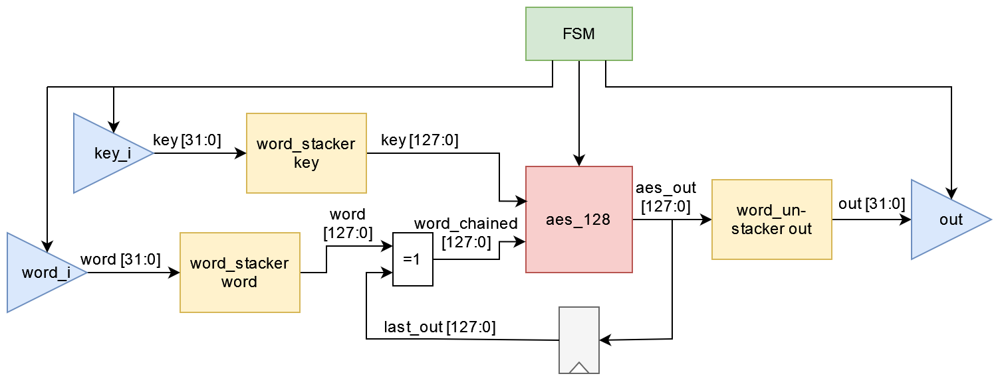

# AES Hardware Processing Engine (HWPE)

This project integrates the [aes_128](https://github.com/www-asics-ws/aes_128) encryption IP into the [PULPissmo](https://github.com/pulp-platform/pulpissimo) system-on-chip. It is based on the [Hardware MAC Engine](https://github.com/pulp-platform/hwpe-mac-engine) which is a template hardware processing engine (HWPE).

The HWPE has been verified in simulation and in FPGA emulation. Furthermore, an ASIC implementation was done to estimate the energy consumed per encryption.

## Architecture

The data (both word & key) are fed into the unmodified AES encryption core via word stackers which create the required 128-bit data words. Additionally, the output is fed back to the data input to implement [Cipher Block Chaining (CBC)](https://en.wikipedia.org/wiki/Block_cipher_mode_of_operation#Cipher_block_chaining_(CBC)). A word unstacker serialises the output to 32 bit wide words.

The datapath is a ready/valid pipeline with a latency of 21 cycles, however the AES core is not pipelined. Thus, the throughput is limited to one encryption per 17 cycles.



This design supports 128 bit AES encryptions in the CBC mode of operation with variable numbers of encryptions. The HWPE uses slightly simplified memory interfaces and control logic from the MAC Engine. Thus, it can be configured via PULPissimo's peripheral bus.

## Results

### FPGA Implementation

The following resources are consumed by the AES HWPE on a Digilent Genesys 2 board:

Entity | LUTs | Registers | BRAM Tiles
--- | --- | --- | ---
Available on FPGA | 203800 | 407600 | 445
PULPissimo | 58656 | 45155 | 144
HWPE Top | 3892 | 3115 | 0
HWPE Ctrl | 172 | 165 | 0
HWPE Streamer | 2151 | 1886 | 0
HWPE Engine | 1569 | 1064 | 0
AES Core | 1247 | 530 | 0
Word Stacker (each) | 26 | 131 | 0
Word Unstacker | 118 | 131 | 0

### ASIC Implementation

An ASIC implementation flow with a TSMC 65nm technology yields the following results:

- Clock frequency 625 MHz
- Timing clean for worst case (0.9 V 125°C) and best case (1.1 V 0°C)
- 25509 standard cells
- Core Area 69420.8 um^2 (83056 um^2 including physical cells)
- Static power: 0.435 mW
- Energy per single encryption (datapath only): 467 pJ
- Energy per pipelined encryption (datapath only, N=1024): 425.2 pJ
- Estimated energy per single encryption (full HWPE): 1131.4 pJ

### Hardware vs. Software

Metric | CPU | HWPE
--- | --- | ---
Code Size [bytes] | 10052 |  9096
Execution Time [cycles] | ~18300 | 97
Cycles per further encryption | ~4500 | 17
Area Overhead (TSMC65) [um^2] | 0 | 83056
Energy/Encrpytion [nJ] | ~46 | ~1 (CPU) + 1 (HWPE) = 2

Code sizes and execution times were measured with a demo program encrypting four 128-bit words both on the CPU and the HWPE.

The energy assumes a (quite optimistic) 10 pJ/operation CPU running at 650 MHz.

## Prerequisites

This project is based on [PULPissmo](https://github.com/pulp-platform/pulpissimo) (as of [September 29, 2021](https://github.com/pulp-platform/pulpissimo/tree/3c9bde1b539679401d4e204716c43bf9422e026d)). Consider the repository's `README` for setup details and prerequisites. Use the PULP SDK instead of the simple runtime.

The following tools were used:

- Mentor Questa Sim for logic simulation (tested with version 10.7c)
- Cadence Genus for synthesis (version 19.10)
- Cadence Innovus for implementation (version 20.11)
- Cadence Voltus for power estimation (version 20.11)
- Xilinx Vivado for FPGA synthesis & PnR (version 2020.2)

The ASIC synthesis requires access to the TSMC 65nm general purpose PDK. The FPGA demo was flashed onto a Digilent Genesys2 board.

## Getting Started

Clone this repository into your `pulpissimo/ips` directory. Then replace the default `hwpe-mac-engine` with this HWPE:

```
cd pulpissimo/ips
git clone https://github.com/sevjaeg/hwpe-aes
rm -rf hwpe-mac-engine
mv hwpe-aes hwpe-mac-engine
```

There are two demonstration programs available in the `sw` directory. `aes_cpu` uses the [tiny-AES-c](https://github.com/kokke/tiny-AES-c) library to run four encryptions on the CPU, `aes_hwpe` offloads these computations to the HWPE.

### RTL Simulation

As the HWPE is disabled by default, set the parameter `USE_HWPE` in line 16 of `pulpissimo/rtl/pulpissimo/pulpissimo.sv` to `1`. Make sure to re-build the simulation environment with `make build` in the PULPissimo root directory.

Then, you can navigate to one of the demo software directories and call

```
make clean all run
```

to start the simulation in Questa Sim. You might want to add `gui=1` and `do ../../wave.do` (only for `aes_hwpe`) to look into the waveforms.

### FPGA Demo

If you have a Genesys 2 FPGA board at hand, you can emulate PULPissimo with the AES HWPE. Again, set  `USE_HWPE` in line 81 of `pulpissimo/fpga/pulpsissimo-genesys2/rtl/xilinx_pulpissimo.v` to `1`. Generate the bitstream with `make genesys2` in `pulpissimo/fpga` and flash it with the Vivado GUI.

Follow the procedure outlined [here](https://github.com/pulp-platform/pulpissimo/tree/3c9bde1b539679401d4e204716c43bf9422e026d#fpga) to run one of the demo programs on the board. Make sure to set the baud rate of the UART connection (`J15`) to `230400`.

### ASIC Synthesis

Navigate into the `impl` directory. There, run `make pnr` to run the RTL to GDSII flow.

### Post-Layout Simulation

The behaviour of the synthesised HWPE can be verified and analysed with post-synthesis and post-layout simulations. The test benches from the `tb` directory cover subsets of the HWPE. To simulate the full HWPE inside PULPissimo, modify the `src_files.yml` file.

Furthermore, a simulation library of the technology has to be placed in `impl/hdl`. As the synthesised design does not provide any parameters, comment out line 78 in `pulpissimo/ips/pulp_soc/rtl/fc/fc_hwpe.sv `:

```verilog
mac_top_wrap #(
    // .ID  ( ID_WIDTH )
) i_mac_top_wrap (
```

Then, rebuild the simulation environment with

```
make scripts
make clean build
```

in the PULPissimo root directory. Finally, you can run the demo programs with the synthesised HWPE by calling

```
make clean all run
```

in on of the `sw` subdirectories. Again, feel free to use `wave_synth_top.do` to look into the waveforms.

### Power Estimation

To perform a vector power analysis, we need a `vcd` file of the post-layout netlist. Start Questa for the post-layout simulation and start a new simulation with.

```
Simulate->Start Simulation
```

Select the design unit `work.vopt_tb` and in the SDF tab select the corresponding file (`impl/out/mac_top_wrap_layout.sdf`) for entity `/tb_pulp/i_dut/soc_domain_i/pulp_soc_i/fc_subsystem_i/fc_hwpe_gen/i_fc_hwpe/i_mac_top_wrap/u1` with delay `max`.

Click ok and run the following script:

```
do ../../power_sim.do
```

The generated `vcd` file is >2 GB, thus this might take a while. Once Questa Sim is done, you can run the power estimation with Voltus:

```
cd pulpissimo/ips/hwpe-mac-engine/impl
make power
```

In case you changed the design, you might want to update the analysis start and end time in `scripts/power.tcl`. The results are written to `reports/mac_top_wrap/power/`. Note that the RTL simulation clock frequency is 50 MHz.

## Credits

Thanks to Nahla and the [Institute of Computer Technology at TU Wien](https://www.ict.tuwien.ac.at/en/) for providing tools, technology files, FPGA boards, as well as patient support.
